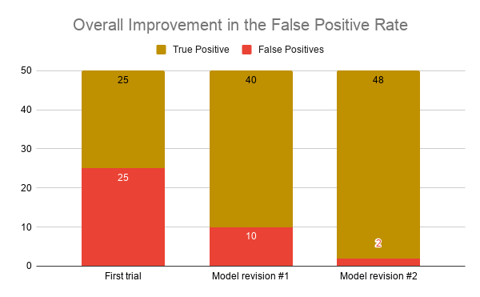
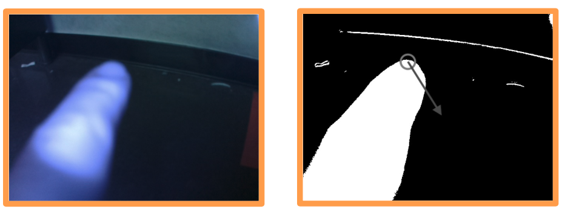

# Bake-Off 2- Explainable CamIoT
**The goal of this Bake Off was to integrate Human-Artificial Intelligence interaction.**
---
## Project Title: Explainable CamIoT
**CamIoT (camera-based Internet of Things device ) is the name of a research project under Prof. Chen. The detailed code and documentation of camIoT is not discussed and shared here as the project is currently at journel submission pending status (Hopefully it will be uploaded soon).**
---
## ***More about CamIoT first:***

### ***Utilizing machine learning the wrist worn CamIoT lets users interact with home appliances by taking a picture of the appliance user's pointing at.*** 
#### ***CamIoT includes three main sections:***

1. ***Triggering mechanism: The user would lift his arm from stationary state and point toward the object he likes to interact with. This gesture would tell CamIoT to start taking picture.*** 
2. ***Object Classification: Using a pretrained VGG-19 and by only taking 3 pictures (and data augmentation)from each appliance we train CamIoT's classification model.***
3. ***Interact with appliances using the Index finger.***

---
## Now what is Explainale CamIoT:
In Explainale CamIoT we focused on section 1 and 3 of CamIoT. Our goal was to improve camIoT behavior in triggering and interacting with the index finger.

### Triggering Mechanism Improvement:
The triggering mechanism was developed using Decision Tree classification, training only on a single person. So to enhance the triggering performance. We developed a GUI that trains the users how to perform the triggering mechanism correctly. We applied Rule Extraction to give feedback to users. For training the gesture, we used acceleration data in x,y,z axes (Ax,AY,Az) using [MPU-6050](https://www.sparkfun.com/products/11028) IMU sensor. Our study showed each triggering gesture includes a max followed by a min in Ax and Ay axes. Calculating the min and max ranges, changes in velocities and proportional time stamps of where such points happened in training data we analyzed our users' performance. Our GUI would then turned those analysis into simple implicit feedbacks such as : "Seems like you started early, go a bit slower next time... ".After user learns the triggering gesture, we run another test this time in continous domain, this time user would move around the testing room while randomly performing the gesture. This stage was mainly to improve on the rate of false of positive labels. In this round an on-board LED used to provide feedback to users. The users' data are saved and used later on to improve the model overall performance. So far from three iterations of running the model on participants and retraining the model based on found feedbacks, we brought the false positive rate from **~50% to ~3%**. 

### Interacting with the Index Finger Improvement:
For this step, the system uses Infrared LEDs to take two pictures with LEDs on and off. Based on the IR reflection from the surface of the finger and subtracting the two pictures it finds the location and direction of the finger which then helps with providing different commands such as : UP,DOWN,LEFT,RIGHT . Now as each user may wear the CamIoT differently and therefore pointing in different ways. Our GUI would help the user center their finger according to the camera lense and their way of pointing. Once the tip of the index finger is centered the system reaches better overall accuracy. We only tested this feature in dark places as our LEDs were not powerful enough to counteract ambient lighting. So numerical analysis is not yet provided for this part. The goal would be to provide something as below:

---

### Repository explained:
1. DataCollection and Training: This folder includes the scripts used for collecting and training the decision tree model used for detecting the triggering gesture. In case you'd like to train more data to evaluate the model, please keep in mind:
   
    1. Data file format should be.csv
    2. First row should be the titles, first row first column is "Class" and the remaining columns of the first row are xi,yi,zi i being from 1-14
    3. The data collection for triggering considers 1.7 second window with step time of 0.1 second (which can be modified).
    
2. raspberryPiCodes: These are the codes directly ran on CamIoT wearable, which used a [raspberry pi Z W](https://www.raspberrypi.org/products/raspberry-pi-zero-w/) as its MCU.
3. poster : This folder contains our final poster and midterm presentation slides along with the shown graphs.
4. serverGuiCode: Finally this folder explains the processing and analysis our system runs on the server side given the data received from raspberryPi. 

---
**You may find our final demo [here](https://www.youtube.com/watch?v=NoLr-y49aOo&feature=youtu.be) and our poster [here](https://github.com/Amir-Omidfar/m209As/blob/master/bakeOff2/poster/poster.pdf)**
---
### References:
1. [Decision Tree model](https://scikit-learn.org/stable/modules/tree.html)
2. [Python Socket Library](https://docs.python.org/3.4/library/socketserver.html)
3. [Python OpenCV Library](https://docs.opencv.org/2.4/modules/core/doc/operations_on_arrays.html?highlight=subtract#cv2.subtract)

### Related Readings:
1. [Rule Extraction Algorithm for Deep Neural Networks: A Review](https://arxiv.org/abs/1610.05267)
2. [Explainable AI for Trees: From Local Explanations to Global Understanding.](https://arxiv.org/pdf/1905.04610.pdf)
3. [Activity Recognition from Accelerometer Data](http://new.aaai.org/Papers/IAAI/2005/IAAI05-013.pdf)

